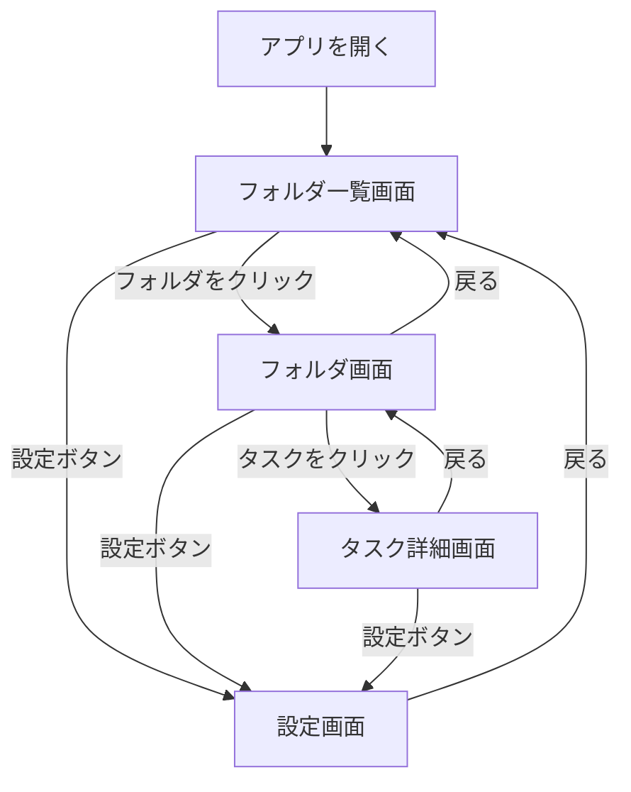
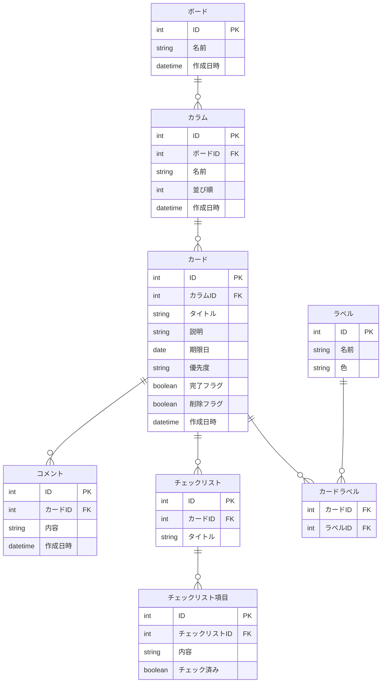

# 要件定義書　タスク管理アプリ（Trello風）
# ④ 構成

---

## ④ 構成

### 画面構成
| 画面 | 主な内容 |
|------|---------|
| フォルダ一覧画面 | フォルダの一覧表示・作成・編集・削除 |
| フォルダ画面 | グループ・タスクの一覧表示・操作 |
| タスク詳細画面 | タスクの詳細表示・編集・コメント・チェックリスト |
| 設定画面 | タグの管理・ゴミ箱（削除したタスクの復元・完全削除） |

### モジュール
| モジュール | 備考 |
|-----------|------|
| フォルダ | |
| グループ | |
| タスク | |
| タグ | |
| 期限 | |
| アラート機能 | 期限1週間以内→黄色、期限切れ→赤、完了→灰色 |
| ゴミ箱機能 | 削除→ゴミ箱→復元 or 完全削除 |
| コメント | タスクへのメモ |
| チェックリスト | タスク内サブタスク |
| 優先度 | 手動設定・緑/青/茶色/オレンジ/紫/黒/白から選択 |

### 画面遷移図

### ER図

