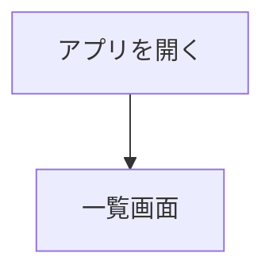
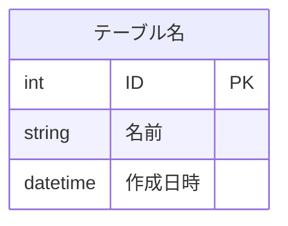

# 要件定義書　〇〇アプリ

---

## ① 使用目的
このアプリを作る目的・背景・活用シーンを記載する。

---

## ② 対象ユーザー・ユースケース

**対象ユーザー：** （例：自分・社内スタッフ・一般ユーザーなど）

**ユースケース：**

| ユースケース | 機能要件 |
|------------|---------|
| （例：タスクを作成・管理する） | F01, F02 |

---

## ③ 非機能要件

| カテゴリ | 内容 |
|---------|------|
| 対応ブラウザ | （例：Google Chrome 最新版） |
| 対応デバイス | （例：PCのみ・スマホ対応など） |
| データ保持 | （例：localStorage・DB使用など） |

---

## ④ 構成

### 画面構成
| 画面 | 主な内容 |
|------|---------|
| （例：一覧画面） | （例：データの一覧表示・作成・編集・削除） |

### モジュール
| モジュール | 備考 |
|-----------|------|
| （例：ユーザー管理） | |

### 画面遷移図

### ER図

---

## ⑤ 機能要件

### 〇〇機能
| ID | 機能名 | 内容 |
|----|--------|------|
| F01 | （例：作成） | （例：新規データを作成できる） |

---

## ⑥ 技術スタック（開発環境は基本設計に記載）

## 1. フロントエンド

| 項目 | 技術 |
| --- | --- |
| （例：言語） | （例：HTML / CSS / JavaScript） |

## 2. バックエンド

| 項目 | 技術 |
| --- | --- |
| （例：言語） | （例：Java） |
| （例：フレームワーク） | （例：Spring Boot） |
| （例：ビルドツール） | （例：Gradle） |
| （例：API形式） | （例：REST API） |

## 3. データベース

| 項目 | 技術 |
| --- | --- |
| （例：RDBMS） | （例：PostgreSQL） |

## 4. 開発ツール

| 項目 | 技術 |
| --- | --- |
| （例：エディタ） | （例：Cursor） |
| （例：バージョン管理） | （例：Git + GitHub） |

---

## ⑦ 開発期間
（例：2週間）
