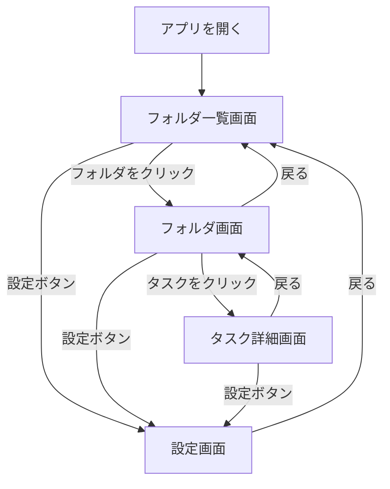
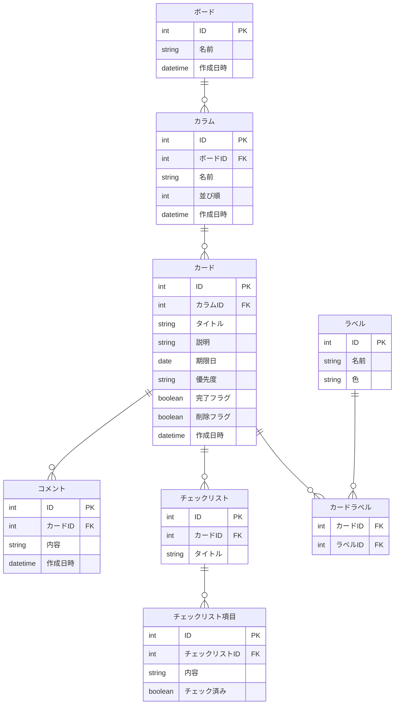

# 要件定義書　タスク管理アプリ（Trello風）

---

## ① 使用目的
講義の課題として作成するTrello風タスク管理アプリ。自身のタスクを管理できるアプリケーションとして活用することを目的とする。

---

## ② 対象ユーザー・ユースケース

**対象ユーザー：** 自分（将来的にチーム向けに拡張する可能性あり）

**ユースケース：**

| ユースケース | 機能要件 |
|------------|---------|
| フォルダ（仕事・プライベートなど）を作成・管理する | F01, F02, F03 |
| フォルダ内にグループ（未着手・進行中など）を追加・並べ替える | F04, F05, F06, F07 |
| タスクを作成する | F08, F09, F31 |
| タスクを別のグループに移動する | F11, F12 |
| タスクに締め切りを設定して期限切れを確認する | F17, F18, F19, F20 |
| タスクにタグを付けて分類する | F13, F14, F15, F16 |
| タスクの優先度を設定する | F21 |
| タスクにメモやサブタスクを追加する | F22, F23, F24, F25, F26, F27 |
| タスクを削除・元に戻す | F10, F28, F29, F30 |

---

## ③ 非機能要件

| カテゴリ | 内容 |
|---------|------|
| 対応ブラウザ | Google Chrome（最新版） |
| 対応デバイス | PC（デスクトップ・ノートPC）のみ |
| データ保持 | DB使用（詳細は後で確定） |

---

## ④ 構成

### 画面構成
| 画面 | 主な内容 |
|------|---------|
| フォルダ一覧画面 | フォルダの一覧表示・作成・編集・削除 |
| フォルダ画面 | グループ・タスクの一覧表示・操作 |
| タスク詳細画面 | タスクの詳細表示・編集・コメント・チェックリスト |
| 設定画面 | タグの管理・ゴミ箱（削除したタスクの復元・完全削除） |

### モジュール
| モジュール | 備考 |
|-----------|------|
| フォルダ | |
| グループ | |
| タスク | |
| タグ | |
| 期限 | |
| アラート機能 | 期限1週間以内→黄色、期限切れ→赤、完了→灰色 |
| ゴミ箱機能 | 削除→ゴミ箱→復元 or 完全削除 |
| コメント | タスクへのメモ |
| チェックリスト | タスク内サブタスク |
| 優先度 | 手動設定・緑/青/茶色/オレンジ/紫/黒/白から選択 |

### 画面遷移図

---

### ER図

---

## ⑤ 機能要件

### フォルダ
| ID | 機能名 | 内容 |
|----|--------|------|
| F01 | フォルダ作成 | 新規フォルダを作成できる |
| F02 | フォルダ編集 | フォルダ名を変更できる |
| F03 | フォルダ削除 | 確認ダイアログ表示後、フォルダを中のグループ・タスクごと削除できる |

### グループ
| ID | 機能名 | 内容 |
|----|--------|------|
| F04 | グループ作成 | フォルダ内にグループを追加できる |
| F05 | グループ編集 | グループ名を変更できる |
| F06 | グループ削除 | 確認ダイアログ表示後、グループを中のタスクごと削除できる |
| F07 | グループ並び替え | グループの順番をドラッグ＆ドロップで変更できる |

### タスク
| ID | 機能名 | 内容 |
|----|--------|------|
| F08 | タスク作成 | グループ内にタスクを追加できる |
| F09 | タスク編集 | タスクのタイトル・内容を編集できる |
| F10 | タスク削除 | タスクをゴミ箱に移動できる |
| F11 | タスク移動 | タスクをグループ間でドラッグ＆ドロップで移動できる |
| F12 | タスク並び替え | グループ内のタスクの順番を変更できる |

### タグ
| ID | 機能名 | 内容 |
|----|--------|------|
| F13 | タグ作成 | タグを作成できる |
| F14 | タグ編集 | タグ名・色を変更できる |
| F15 | タグ削除 | タグを削除できる |
| F16 | タグ付与 | タスクにタグを付ける・外すことができる |

### 期限・アラート
| ID | 機能名 | 内容 |
|----|--------|------|
| F17 | 期限設定 | タスクに期限日をカレンダーUIで設定・編集・削除できる |
| F18 | 期限アラート（黄） | 期限1週間以内のタスク全体を黄色で表示する |
| F19 | 期限アラート（赤） | 期限切れのタスク全体を赤で表示する |
| F20 | 完了表示 | 完了したタスク全体を灰色で表示する（手動操作） |

### 優先度
| ID | 機能名 | 内容 |
|----|--------|------|
| F21 | 優先度設定 | タスクのタイトル部分に優先度の色を手動で設定・変更・削除できる |

### コメント
| ID | 機能名 | 内容 |
|----|--------|------|
| F22 | コメント追加 | タスクにコメントを追加できる |
| F23 | コメント編集 | コメントを編集できる |
| F24 | コメント削除 | コメントを削除できる |

### チェックリスト
| ID | 機能名 | 内容 |
|----|--------|------|
| F25 | チェックリスト作成 | タスク内にチェックリストを追加できる |
| F26 | 項目管理 | チェックリストの項目を追加・編集・削除できる |
| F27 | チェック操作 | 項目にチェックを入れる・外すことができる |

### ゴミ箱
| ID | 機能名 | 内容 |
|----|--------|------|
| F28 | ゴミ箱確認 | 削除したタスクをゴミ箱で一覧表示できる |
| F29 | タスク復元 | ゴミ箱からタスクを元のグループに戻せる |
| F30 | 完全削除 | ゴミ箱のタスクを完全に削除できる |

### 日付
| ID | 機能名 | 内容 |
|----|--------|------|
| F31 | 作成日自動記録 | タスク作成時に作成日を自動で記録・表示する |

---

## ⑥ 開発環境

| 種類 | 技術 |
|------|------|
| フロントエンド | HTML / CSS / JavaScript |
| データ保存 | DB（詳細は後で確定） |
| ドラッグ＆ドロップ | Sortable.js |
| エディタ | VS Code |
| バージョン管理 | Git / GitHub |

**制約事項：**
- 講義の課題として開発

---

## ⑦ 開発期間
2週間（実装1週間・テスト改良1週間）
